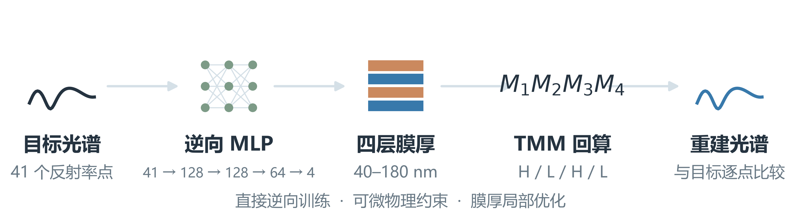
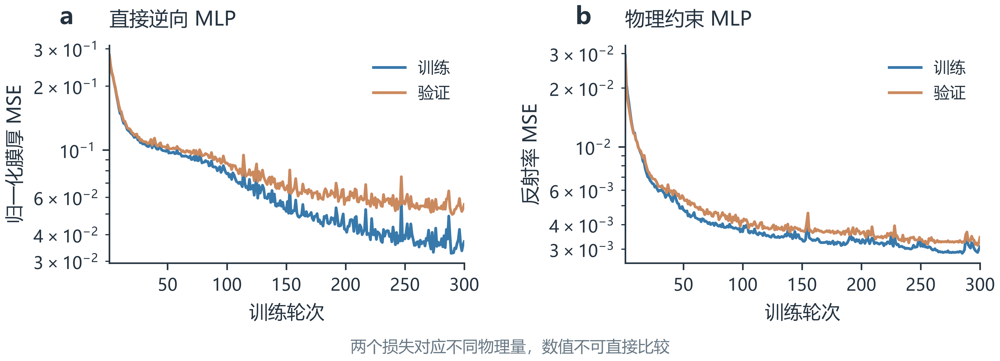
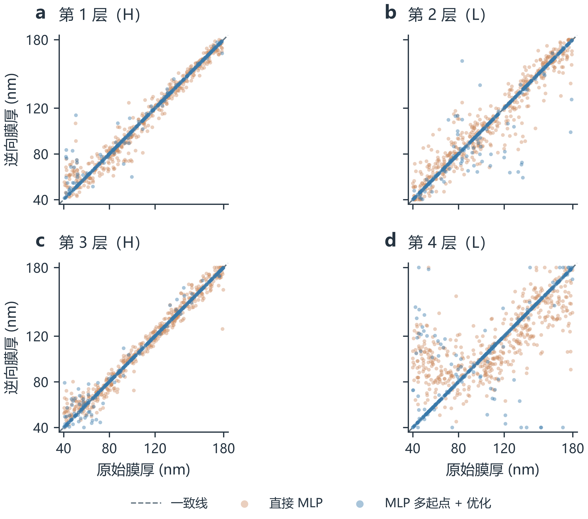
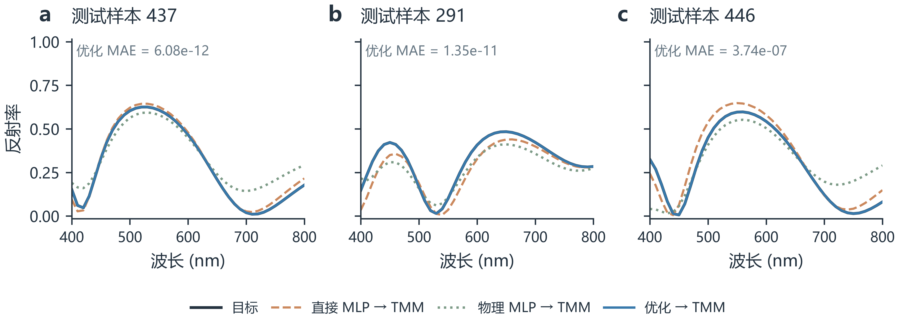
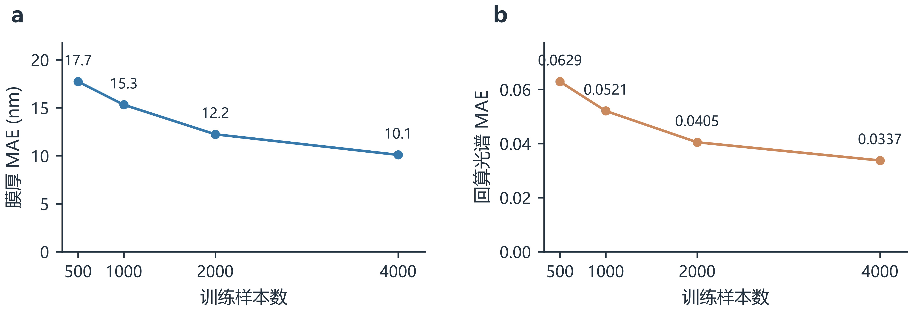
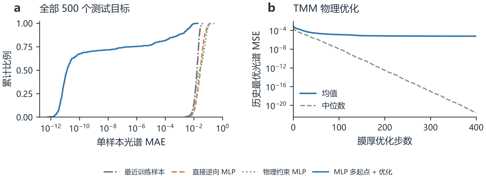
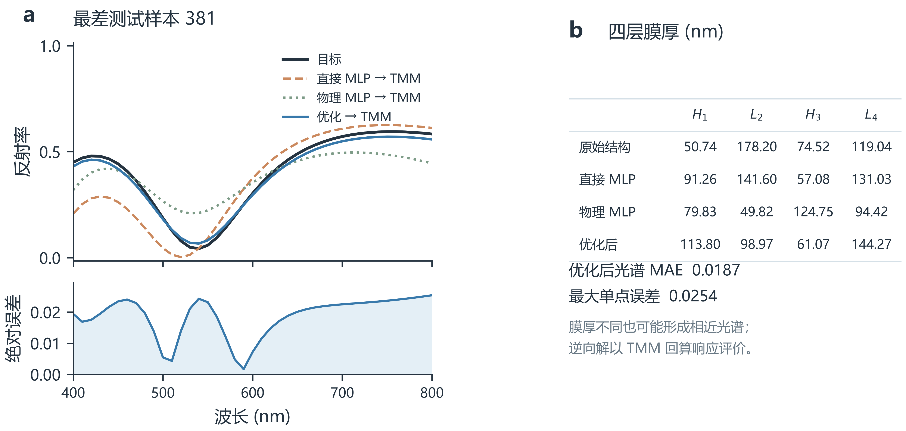

# 附加实验 目标反射光谱到四层膜厚的反向预测

姓名：陈新堉　学号：2023270069

## 1 任务与条件

输入为400、410、…、800 nm的41点目标反射率，输出从空气侧依次排列的四层膜厚[d1,d2,d3,d4]。本轮反向实验依据新增任务开展。结构为Air/H/L/H/L/Glass，正入射、无损、忽略色散，折射率依次为1.00/2.30/1.45/2.30/1.45/1.52；玻璃为半无限基底。膜厚范围40–180 nm。复用原5000组数据和4000/500/500划分，seed=270069、design_seed=270070，个性化波长520 nm。

## 2 模型与评价

直接反向MLP为41–128–128–64–4，隐藏层ReLU，输出线性层。输入使用原始反射率[0,1]，膜厚标签按2(d−40)/140−1归一化。与正向实验一致，Adam学习率0.001、batch=128、训练300轮；按500组验证集最小归一化膜厚MSE选权重。依次使用原训练池前500/1000/2000/4000组，测试集固定500组。

直接模型的原始输出膜厚MAE为10.1896 nm，2000个膜厚值中31个越界；原始输出及越界统计已完整保存。实现合法膜结构时将输出投影到[40,180]，表中的直接模型光谱指标由投影后的结构经TMM回算。投影前后指标分别记录，未把投影隐去。

额外训练物理约束反向MLP：隐藏宽度、数据划分、初始化种子和训练参数相同；输出增加tanh以保证膜厚范围。其损失为精确可微TMM的回算光谱与输入光谱之间的MSE，不使用膜厚标签监督；按验证光谱MSE选权重。该模型与直接模型的损失不同，不能比较两个损失值的数值大小。

TMM优化为独立推理步骤：使用直接MLP、物理MLP及物理MLP的5/10/20 nm固定种子扰动，共5个起点，进行400步有边界Adam优化，归一化膜厚学习率0.02。每个起点保存历史最小光谱MSE，最后依据已输入的目标光谱选取最小误差结构。优化既不读取目标的真实膜厚，也不更新MLP权重。最近邻对照仅检索4000组训练光谱。

## 3 固定500组测试结果

| 方法 | 膜厚MAE (nm) | TMM回算光谱MSE | TMM回算光谱MAE | 520 nm MAE | 单样本光谱MAE的P90 |
| --- | ---: | ---: | ---: | ---: | ---: |
| 直接反向MLP（边界投影后） | 10.0945 | 0.002473982 | 0.033748 | 0.037300 | 0.064891 |
| 物理约束反向MLP（一次推理） | 33.2208 | 0.003157875 | 0.036312 | 0.036435 | 0.078359 |
| MLP多起点＋TMM优化 | 2.8185 | 5.897152e-06 | 0.000576 | 0.000512 | 0.002053 |
| 训练库光谱最近邻 | 15.6541 | 0.0004813011 | 0.016651 | 0.017350 | 0.024767 |

物理约束MLP一次推理的光谱MAE为0.036312，本轮未改善直接MLP的整体光谱MAE；它的中位数较低，但大误差尾部更长。最近邻检索的光谱MAE为0.016651，优于两种MLP的一次推理均值，因此当前结果不支持反向MLP已经优于简单检索的结论。

多起点TMM优化后的光谱MAE为0.000576，单样本中位数为1.348e-11，最大值为0.018675。优化后光谱MAE小于0.01的样本比例为99.6%。这些优化结果属于组合流程，不能描述为MLP一次推理的精度；测试目标均由相同TMM模型生成，属于可实现目标，不代表实验测量精度。

## 4 训练样本量效应

| 训练样本数 | 原始膜厚MAE (nm) | 合法结构膜厚MAE (nm) | 回算光谱MAE | 最优验证轮次 |
| ---: | ---: | ---: | ---: | ---: |
| 500 | 17.8423 | 17.7259 | 0.062907 | 295 |
| 1000 | 15.4093 | 15.3170 | 0.052077 | 298 |
| 2000 | 12.2854 | 12.2369 | 0.040482 | 296 |
| 4000 | 10.1896 | 10.0945 | 0.033748 | 290 |

## 5 理论解释与结果边界

反射率只保留幅度信息，逆映射可能存在多个或近似等价结构。因此膜厚误差与实现目标光谱的误差必须同时考察，不能把原膜厚标签当作唯一合法答案。所有光谱指标均由真实TMM复算，未使用正向MLP代理评分。研究边界为无损、无色散、正入射及固定H/L/H/L层序；对任意输入光谱不保证该膜系能够实现，也不保证有边界局部优化得到全局最优。结果来自固定单一随机种子，不提供未经重复实验估计的置信区间。

已额外使用design_seed独立生成10000组新结构和目标光谱，评价两种反向MLP一次推理的泛化；结果记录于summary.json的independent_10000字段。新目标不参与训练或权重选择。examples中提供原正向筛选Top5候选的完整目标光谱及反向设计结果，可直接用CLI预测。

## 6 图表

### 图1 反向任务流程与物理复核



### 图2 直接与物理约束模型的原始训练损失



### 图3 四层膜厚恢复及近似等价结构



### 图4 按固定误差分位选择的代表性光谱



### 图5 相同划分下的训练样本量效应



### 图6 500组测试误差分布与优化历史



### 图7 优化后最大误差案例



## 7 运行与复核

在仓库目录运行：

```powershell
python -m thinfilm.inverse_experiment --source results --output results/inverse
python -m thinfilm.inverse_verify --output results/inverse
python -m thinfilm.inverse_predict --spectrum results/inverse/examples/target_candidate_8667.csv --output results/inverse/custom_prediction --refine-steps 400
```

模型文件保存在models，原始损失在histories，逐测试样本结果在test_predictions.csv，数组及优化历史在data/test_results.npz。完整精度以CSV和JSON为准，图表只按显示精度标注。

## 理论参考

- Liu D, Tan Y, Khoram E, Yu Z. Training Deep Neural Networks for the Inverse Design of Nanophotonic Structures. ACS Photonics 2018, 5:1365–1369. https://doi.org/10.1021/acsphotonics.7b01377
- Ma TG, Wang H, Guo LJ. OptoGPT: A foundation model for inverse design in optical multilayer thin film structures. Opto-Electronic Advances 2024, 7:240062. https://doi.org/10.29026/oea.2024.240062
